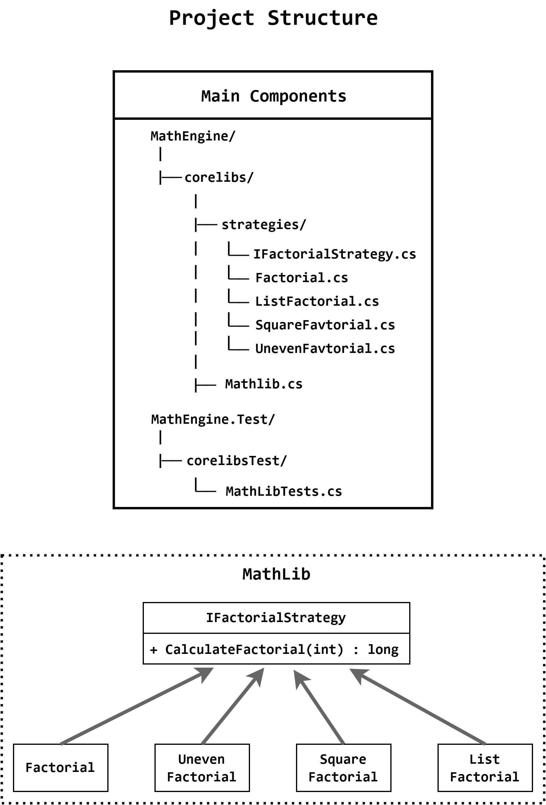

# MathLibTest

This project implements a library called **MathLib**.

The library currently contains different methods of calculating factorial containing the possibility to extend its functionality using the **Strategy Design Pattern** is used for the core implementation.

